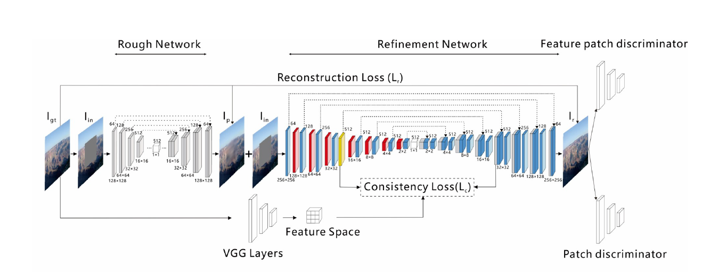
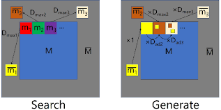
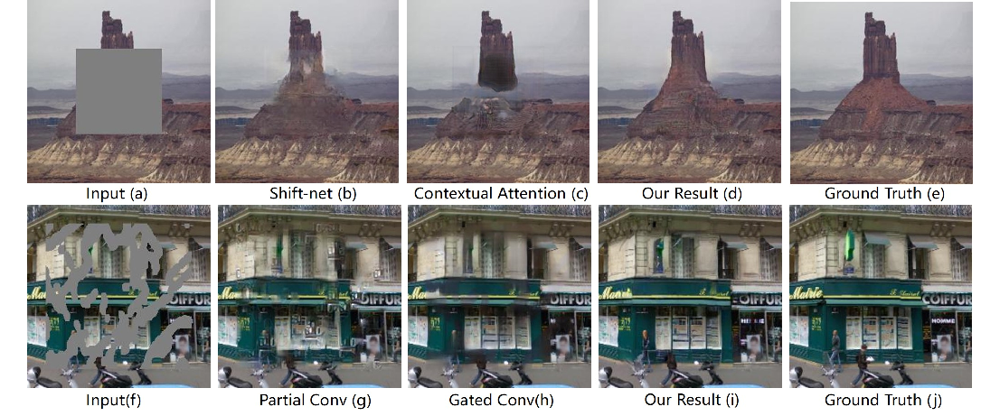
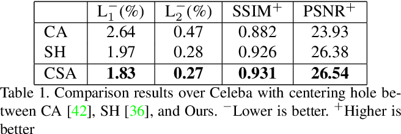
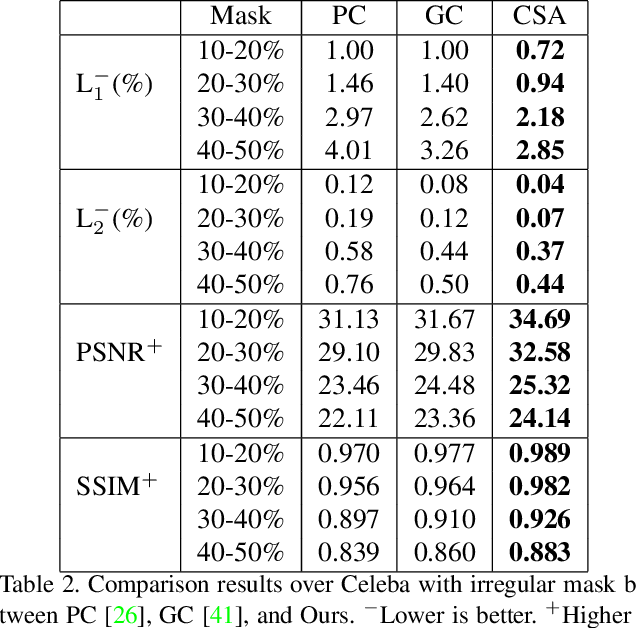

# Coherent Semantic Attention for Image Inpainting

[Somodyuti Pal](https://www.linkedin.com/in/somodyuti-pal-a01028136/)

[Image Inpainting](https://en.wikipedia.org/wiki/Inpainting) application which works on reconstructing a distorted or hazy image to its original form, is becoming a prominent part of research. The existing approaches often suffer from blurry & distorted images due to discontinuity of local pixels. The local pixel discontinuity happens due to ignoring the semantic relevance and feature continuity of hole/missing regions.

In this paper The human behavior in repairing pictures,i.e. two steps as **conception** and **painting** are introduced to ensure global structure consistency as well as local pixel continuity of a picture .The approach of painting process,constructing new structures and texture from the end nodes of the structures created previously,that ensures the local pixel continuity of the final result. Inspired by this ,a coherent semantic
attention layer (CSA)is proposed which will retain fine details.

Rough,Repainting & CSA Architecture

## The Proposed System

-  The Proposed model consists of two steps: **1. Rough Inpainting** & **2.    Refinement Inpainting** 
   - **1. Rough Inpainting** -  Training of a rough network to rough out the missing contents/holes is followed. This stabilizes the training and ensures ta larger receptive field.
     be the ground truth &(3* 256 * 256 shape) be the input to rough framework. From these  two  we try to have the rough prediction by using  convolutions with skip connections.
     
    - **2. Refinement Inpainting** - This consists of two stages 
        
       - **Refinement Network** -  is conditioned on  as a input of The encoder-decoder pair of ths network with  convolutions to double channels &   **Dilated Convolutions** to reduce spatial size that enlarges receptive fields.
        
       - **Coherent Semantic Attention** -A novel coherent semantic attention layer is applied to construct the correlation between the deep features of hole regions. Completed in two phases: **Searching and Generating** 
        
      
 
      
Searching & Generating.

       
      

        
        - **Searching** -  CSA layer searches the closest-matching contextual     patch  in 
        known region to initialize   during the search process. and   in feature map are considered &   is used to extract patches ,patches as, to obtain vector values denoting cross correlational value between  and   & compute maximum as .Which stands for similarity between & .
        
        - **Generating** - As a initial patch the left of  is taken and  }{(\parallel m_i \parallel \cdot \parallel \overline{m_i} \parallel)}">  initially is 0. as  is zero. Now the future patches are resolved with a reference from previous as a formulae of  Based on this,an attention map is used to create the attention matrix. Which with deconvolutional layers reconstruct  
   
- **Consistency Loss** - A ImageNet-pretrained VGG-16 is used to extract
a high level feature space from the original image. In , we set the feature space as the target for the CSA layer and the corresponding layer of the CSA
in decoder respectively to compute the the distance as :
  

- **Feature Path Discriminator** -  A feature patch discriminator is developed to discriminate completed images and original images by inspecting their feature maps. As receptive fields of each point features the entire image, the adversarial loss ,
  & Loss function  for discriminators:
 where , represents the operation of taking average for all real/fake data in the mini-batch.

## Experimental Results
  - On three datasets this model was tested **Places2** , **CelebA**,and **Paris StreetView** model is optimized by the **Adam algorithm**
    with a learning rate of 2 × 10−4 and  = 0.5. The tradeoff
    parameters are set as  =1,=0.01, =0.002,with a batch size of 1.The weak correlation areas in attention maps are areas of concern for generated patches which are far from it, the strong correlation areas are areas of concern for both adjacent generated patches and most relevant patches.    
  
  

  
Qualitative comparison

  
  

 - **Effectof CSA Layer** - The CSA layer was replacced with convolutional layers as a query to understand it's importance . And it failed to perform like CSA as the pixels were not consistent with the background.
 Hence global semantic structure and local coherency are constructed by the CSA layer.
 

 
Quantitative comparison

 

 - **Feature path Discriminator** & **Consistency loss** also proved to be much effective than conventional ways.

   

Quantitative comparison

 The inpainting task thus is completed through this two stage method. Whether the unknown region is irregular or centering, this algorithm can achieve state-of-the-art inpainting results. The Human inspired **Rough & Refinement** steps added new path on this application.

The stated method clearly had great effect on inpainting techniques and worked well than other Architectures it compared with. The new introduced **Feature path Discriminator** & **Consistency loss** achieved greater impact than conventional ways.

For code, visit this [link](https://github.com/KumapowerLIU/CSA-inpainting.).