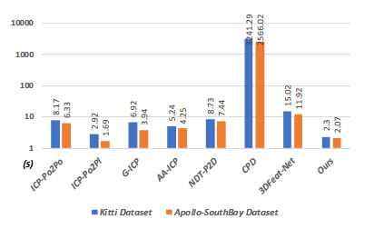

# DeepVCP: An End-to-End Deep Neural Network for Point Cloud Registration

**DeepVCP**(Virtual Corresponding Points) is an end-to-end learning-based 3D point cloud registration framework that achieves comparable registration accuracy to prior state-of-the-art geometric methods of aligning two different point clouds.

Instead of implementing other keypoint based methods where a [RANSAC](https://en.wikipedia.org/wiki/Random_sample_consensus) procedure is usually needed, the implementation of various deep neural network structures is done to establish an end-to-end trainable network. The keypoint detector is trained through this end-to-end structure which enables the system to avoid the inference of dynamic objects and leverages the help of sufficiently salient features on stationary objects, thereby achieving high robustness.

## Main Contributions

* First end-to-end learning based point cloud registration framework.

* Generation of corresponding points are done based on learned matching probabilities among a group of candidates which improves registration accuracy.

* [KITTI](http://www.cvlibs.net/datasets/kitti/raw_data.php) & [Apollo-SouthBay](http://data.apollo.auto/?locale=en-us&lang=en) datasets are used to validate it's efficiency.

Results demonstrate that it achieves comparable registration accuracy and runtime efficiency compared to state-of-the-art geometry-based methods, but with higher robustness to inaccurate initial poses.

*Low registration error* and *high robustness* of this method makes it suitable for substantial applications based on [point cloud registration](https://en.wikipedia.org/wiki/Point_set_registration).

* [Soham Biswas](https://www.linkedin.com/in/soham-biswas-590784168/)
