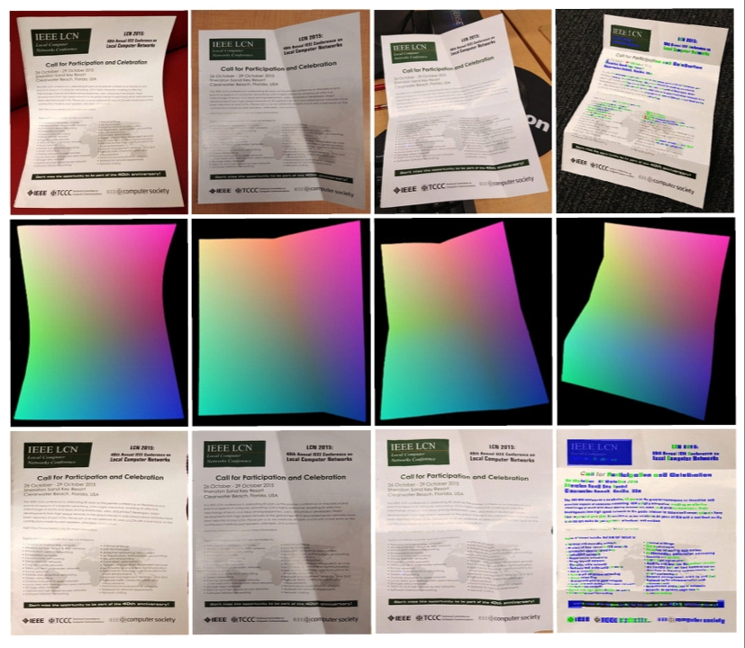
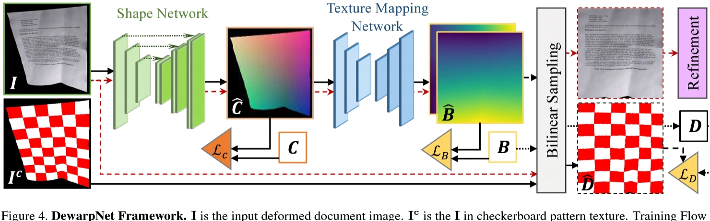

# DewarpNet: Single-Image Document Unwarping With Stacked 3D and 2D Regression Networks
This paper proposes DewarpNet, a deep-learning approach for document image unwarping from a single image, with proper illumination effects. It is a a novel data-driven unwarping framework that utilizes an explicit 3D shape representation for learning the unwarping operation

by <a href="http://www.linkedin.com/in/rajatava-mukherjee-6a3784182">Rajatava Mukherjee</a>

## The Context 
Automatic information extraction and content analysis from document’s images is not suitable due to physical distortion of the document paper, various camera positions and uneven illumination conditions as the images are captured in mobile devices like smart-phones, tabs etc with non-professional approach

## The Drawbacks of Previous works and The Advantages present in DewarpNet
Based on how deformation is modeled, the two groups of prior work on document unwarping are: parametric shape- based models and non-parametric shape-based models
Traditional approaches usually rely on the geometric properties of the paper to recover the unwarping. These methods first estimate the 3D shape of the paper, represented by either some para- metric shape representations or some non-parametric shape representations . After that, they compute the flattened image from the warped image and the estimated shape using optimization techniques. A common drawback of these methods is that they are usually computationally expensive and slow due to the optimization process
Re- cent work by Ma et al. proposed a deep learning system that directly regresses the unwarping operation from the deformed document image. Their method significantly improved the speed of document unwarping system. However their method did not follow the 3D geometric properties of the paper warping – training data was created with a set of 2D deformations – and therefore often generate unrealistic results in testing.

## The work flow of their contributions:
First, they contribute the Doc3D data-set. According to them, this is the first and largest document image data-set with multiple ground-truth annotations in both 3D and 2D domain.
Second, they propose DewarpNet, a novel end-to-end deep learning architecture for document unwarping. This network enables high-quality document image unwarping in real-time.
Third, trained with the rich annotations in the Doc3D data-set, DewarpNet shows superior performance compared to recent state-of-the-art . Evaluating with perceptual similarity to real document scans, it improves the multi-scale Structural Similarity (MS-SSIM) by 15% and reduce the Local Distortion by 36%. Furthermore, they demonstrate the practical significance of our method by a 42% decrease in OCR character error rate.

Figure 1. Document image unwarping. Top row: input images. Middle row: predicted 3D coordinate maps. Bottom row:  predicted unwarped images. Columns from left to right: 1) curled, 2) one-fold, 3) two-fold, 4) multiple-fold with OCR confidence highlights in Red (low) to Blue (high)

## How DewarpNet works?
DewarpNet, as shown in Fig. 2, consists of two sub- networks for learning unwarping: the shape network and the texture mapping network. Additionally, a post-processing refinement module for illumination effect adjustment  visually improves the unwarped images.The training process has two phases. In the first phase, the shape network and the texture mapping network are trained separately for initialization. In the second phase, the two sub-networks are trained jointly to improve the unwarping result.They train the models on the Doc3D dataset of 100,000 images, splitting into training and validation sets such that they have no meshes in common. In the first phase of initialization training, the texture mapping network takes the ground truth 3D coordinate map C as input. Later, in the second phase of joint training, each sub-network is initialized with the best separately trained models.

Figure 2. DewarpNet Framework. I is the input deformed document image. Ic is the I in checkerboard pattern texture. Training Flow is in black lines. The two black dashed lines refer to the predicted (Dˆ) and ground-truth (D) unwarped reconstruction patterns. Testing flow is in red dashed lines. Triangles denote the losses . C and B are the ground-truth for the 3D coordinates and the backward mapping respectively.

## About The Experiment
This method was evaluated with multiple experiments on the 130-image  and also show qualitative results on real images . As a baseline, They train the DocUNet unwarping method on their new Doc3D data-set. Furthermore, they evaluate OCR performance of our method from a document analysis perspective. Finally,They provide a detailed ablation study to show how the use of the Coordinate Convolutions and the loss LD affect unwarping performance.

## Limitations
The inexpensive depth sensor cannot capture fine details of deformation like subtle creases on a paper crumple. Thus our data lacks samples with highly complex paper crumple.
DewarpNet is relatively sensitive to occlusion: results degrade when parts of the imaged document are occluded.
