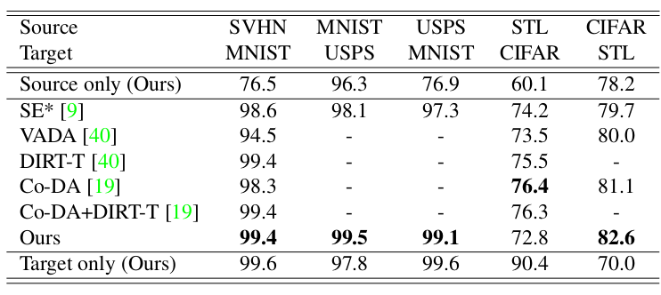
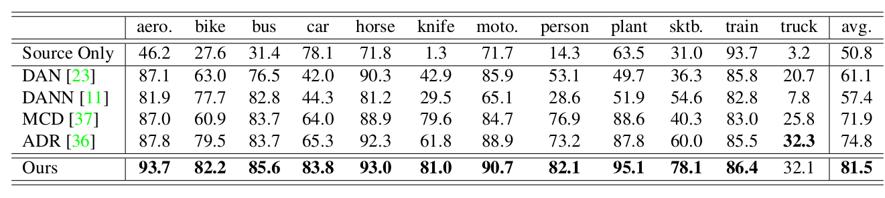
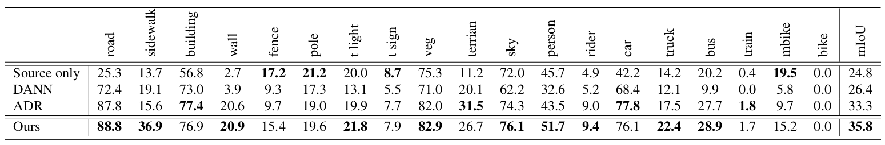

# Drop to Adapt: Learning Discriminative Features for Unsupervised Domain Adaptation

[Purbayan Chowdhury](https://www.linkedin.com/in/purbayan-chowdhury-38126914a/)

With increased demand of synthetic datasets in deep neural networks, [domain adaptation](https://en.wikipedia.org/wiki/Domain_adaptation) becomes a prominent part of research. A model trained on the source domain shows disappointing results in the target domain and this is known as _domain shift_.

In this paper, unsupervised domain adaptation id dealt with domain adversarial training where an auxiliary domain discriminator gives a domain-invariant and non-discriminative feature representation. It implements the cluster assumption (decision boundaries should be placed in low density regions in the feature space) using _Drop to Adapt_ (DTA) with adversarial dropout and introduced element-wise and channel-wise adversarial dropout for fully-connected and convolutional layers, respectively.

## Proposed Method

- **Unsupervised Domain Adaptation** - Two distinctive domains : source  and target domain T = {Xt} where a feature extractor f(x;mf) takes a datapoint from two domains and creates a latent vector which is fed into a classifier c(.; mc). h(x; mf, m c ) = c(f (x; mf ); mc )
- **Adversarial Dropout** - Virtual Adversarial Dropout is used which maximize the divergence between two in-
  dependent predictions to an input. The network h is decomposed into hl and hu by dropout m : h(x;m)=h_u (m⊙ h_l (x)). The divergence between two distributions p and p' is D[p, p']≥ 0.

  - **Element wise** - The element-wise adv. dropout(EAdD) mask madv is defined with respect to a schocastic dropout mask ms as : madv = argmaxm D [h(x; ms ), h(x; m)] where &#124;&#124;ms − m&#124;&#124; ≤ δeL.

  - **Channel wise** - The channel adversarial droupout mask is defined as madv = argmaxm D [h(x; ms ), h(x; m)], where 1/HW ∑ &#124;&#124;ms(i) − m(i)&#124;&#124; ≤ δc C and hl(x) ∈ RC×H×W, where C, H, and W denote the channel, height,
    and width dimensions of the activation, respectively.

- **Drop to Adapt** - The overall loss function is sum of the objectives for task-specific, domain adaptation, entropy minimization and Virtual Adversarial Training(VAT).

  - _Task-specific objective_, LT(S) = - Exs, ys ~ S[ys T log h(x s)], where ys is one-hot encoded vector of ys.

  - _Domain adaptation objective_, LDTA(T) = LfDTA(T) + LcDTA(T),
    where LfDTA(T) = Exs ~ T  [DKL[h(xt; msf ), &#124;&#124;h(xt; madvf)&#124;&#124;],
    and LcDTA(T) = Exs ~ T  [DKL[h(xt; msc ), &#124;&#124;h(xt; madvc)&#124;&#124;]

  - _Entropy minimization objective_, LE(T) = - Ext ~ S[h(x t) T log h(x t)]

  - _VAT objective_, LV(T) = Ext ~ T  [max&#124;&#124;r&#124;&#124; ≤ ∈  DKL[h(xt), &#124;&#124;h(xt + r)&#124;&#124;]

## Experiment Result

### On Small Datasets

**SVHN ⟶ MNIST** - MNIST consists of binary handwritten
digit images, SVHN consists of coloured images of street
house numbers.

**MNIST ⟷ USPS** - MNIST and USPS contain grayscale
images.

**CIFAR ⟷ STL** - CIFAR and STL are 10-class object recognition datasets with coloured images.

Results of experiment on small image datasets.

A substantial margin of improvement is achieved over the source only model across all domain configurations. In four of the five configurations, the stated method outperforms the recent state-of-the-art results.

### On Large Datasets

- The **VisDA-2017** image classification is a 12-class domain adaptation problem. The source domain consists of 152,397 synthetic images, where 3D CAD models are rendered from various conditions.

  

  
Results on VisDA-2017 classification using ResNet-101

  
  

  The table clearly shows that the proposed method surpasses previous methods by a large margin. Note that all methods in this table use the same ResNet-101 backbone.

- For the source domain, the synthetic **GTA5 dataset** which consists of 24966 labelled images is used. As the target domain, the real-world **Cityscapes**, consisting of 5000 images is used.
  

  
Results on GTA → Cityscapes, using a modified FCN with ResNet-50 as the base network

  
  

The stated method clearly improves upon the mIoU of not only the source only model, but also competing methods. Even with the same training procedure and settings as in the classification experiments, DTA is extremely effective at adapting the most common classes in the dataset.

For code, visit this [link](https://github.com/postBG/DTA.pytorch).
