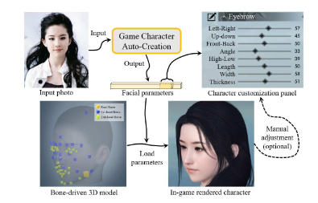
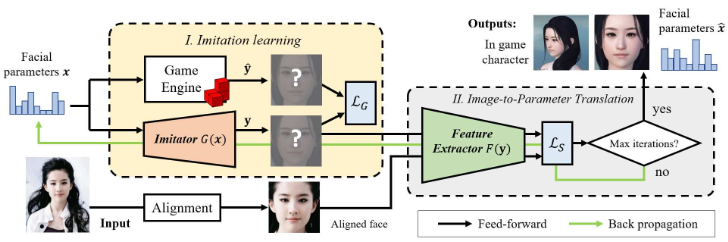
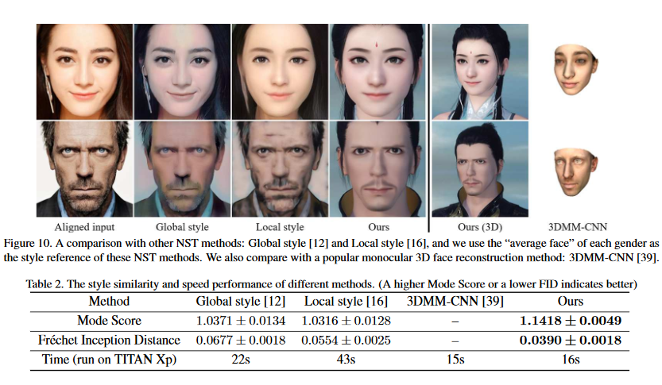

# Face-to-Parameter Translation for Game Character Auto-Creation

**Character customization** system is an important component in *Role-Playing Games(RPGs)*, where players are allowed to edit the facial appearance of their in-game characters with their own preferences rather than using default templates.

This paper proposes a method of automatically creating in-game characters of players according to an input face photo. The above *artistic creation* process is formulated under a facial similarity measurement and parameter searching paradigm by solving an optimization problem over a large set of physically meaningful facial parameters.

## Model Features

* *End-to-end approach* for face-to-parameter translation and game character auto creation.

* Introduction of an **imitator** by the construction of a deep generative network to *imitate* the behavior of a game engine as the rendering process of a game engine is *not differentiable*.

* Creation of two specifically designed **Loss Functions** for *cross-domain facial similarity* measurement:
  * Discriminative Loss
  * Facial Content Loss

* **Robust** against various *blurring* and *illumination* conditions.

* **Sensitive** towards *pose changes*.

**Related Works:** Neural Style Transfer, Monocular 3D face reconstruction, Generative Adversarial Network.

## Proposed Model v/s other Models

* Popular neural style transfer methods such as global style method and local style methods are all designed to measure the similarity of two images on deep learning features and the iterative optimization algorithms in these methods are all performed at the input of networks.

* Popular monocular 3D face reconstruction method, namely 3DMM-CNN can only generate masks with similar facial outlines, whereas auto-created game characters by the proposed model have a higher similarity with the inputs.

Not related to real photos, the proposed method can also generate game characters from artistic portraits, including the sketched image and caricature.

## Conclusion

Experimental results demonstrate that the proposed method achieves a high degree of generation similarity and robustness between the input face photo and the rendered in-game character in terms of both global appearance and local details.

* [Soham Biswas](https://www.linkedin.com/in/soham-biswas-590784168/)
