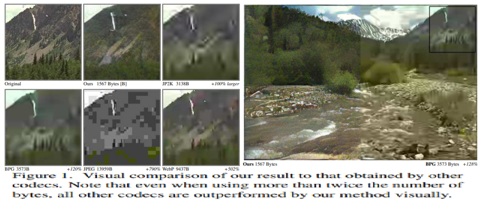
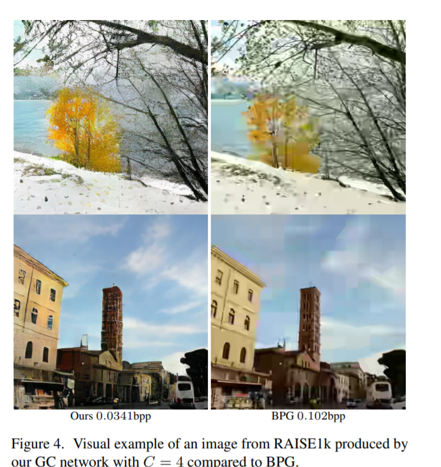
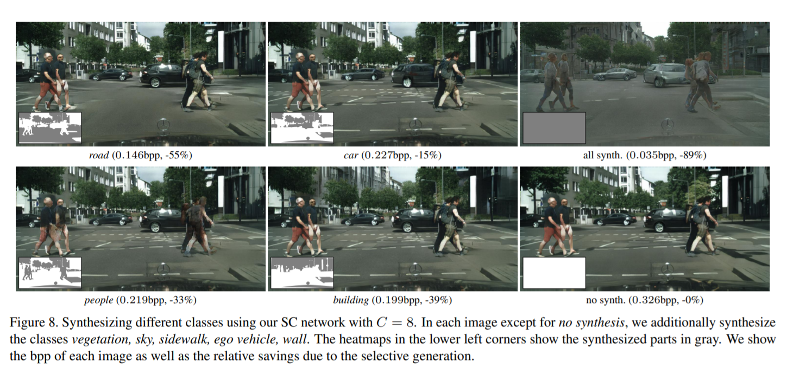

# Generative Adversarial Networks for Extreme Learned Image Compression

Image compression is a type of data compression applied to digital images, to reduce their cost for storage or transmission. Image compression can be 
achieved by many techniques but in this GAN( Generative Adversarial Networks) is used. Here we see a learned image compression system based
on GANs, operating at extremely low bitrates. Bitrate measures how much data is transmitted in a given amount of time and it also describe the quality of image.
A comprehensive user study shows that our compression system yields visually considerably more appealing results than BPG(the current state-of-the-art engineered compression algorithm) and the recently proposed
autoencoder-based deep compression because for very bitrates (below 0.1 bits per pixel (bpp)), where preserving the full image content
becomes impossible, these distortion metrics lose significance as they favor pixel-wise preservation of local (high-entropy) structure over
preserving texture and global structure.

This paper propose a principled GAN framework for full-resolution image compression and use it to realize an extreme image compression system, targeting bitrates
below 0.1bpp.In this framework, we consider two modes of operation :
* Generative Compression (GC) : preserving the overall image content while generating structure of different scales such as leaves of trees or windows in the facade of buildings.
* Selective Generative Compression (SC)  completely generating parts of the image from a semantic label map while preserving user-defined regions with a high degree of detail.

This framework combines an encoder, decoder/generator and a multi-scale discriminator, which we train jointly for a generative 
learned compression objective. The model synthesizes details it cannot afford to store, obtaining visually pleasing results at bitrates 
where previous methods fail and show strong artifacts. 

## Results
###  Generative Compression
GC model is preffered to BGP even when images produced by BPG use 95% and 124% more bits than those produced by GC, this is achieved even
though there is a distribution shift between the training and testing set.Here, we can say that GC models produce images with much
finer detail than BPG, which suffers from smoothed patches and blocking artifacts.The GC models convincingly reconstruct texture in natural
objects where AEDC and the MSE baseline both produce blurry images.

### Selective Generative Compression
The quantitative evaluation of the semantic preservation capacity reveals that the SC networks preserve the semantics somewhat better
than pix2pixHD, indicating that the SC networks faithfully generate texture from the label maps and plausibly combine generated with
preserved image content.In the SC operation mode, networks manage to seamlessly merge preserved and generated image content both
when preserving object instances and boxes crossing object boundaries.

