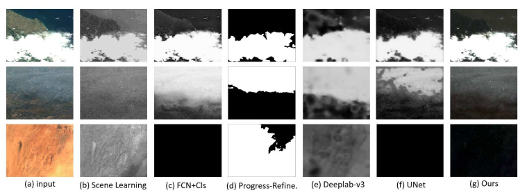
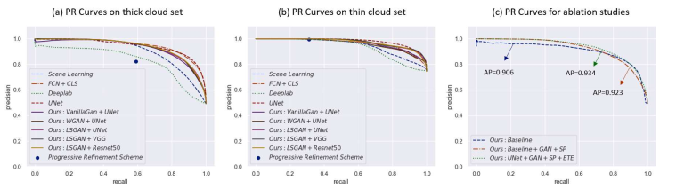
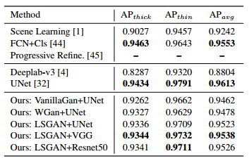
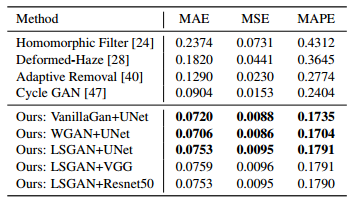
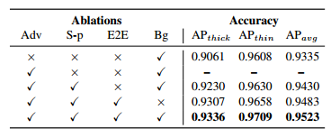

# Generative Adversarial Training for Weakly Supervised Cloud Matting

[Purbayan Chowdhury](https://www.linkedin.com/in/purbayan-chowdhury-38126914a/)

Remote sensing of earth's surface becomes difficult in most case due to the fact that half of earth's surface is covered by clouds every day, so it becomes necessary for the research on cloud detection and removal. The paper reformulates cloud detection and removal as a mixed energy separation between foreground
and background images. It propose a generative adversarial training framework to achieve weakly supervised matting of a cloud image by incorporating the physics behind it.

The model consists of three networks :  a cloud generator *G*, a cloud discriminator *D* and a cloud matting network *F*, jointly trained in an end-to-end fashion. *G* takes in a pair of cloud and background images, and generates a new cloud image and its “ground truth”. *D* takes in the generated image to discriminate it is real or fake and feeds this information back to *G* to further make the generated images indistinguishable. While *F* takes in the cloud image and produce matting outputs: the predicted cloud reflectance and attenuation maps. 

## Imaging Model

The amount of energy  received per unit of time is considered as a linear combination of three components: 1) the reflected energy of the clouds , 2) the reflected energy of the ground objects , and 3) the radiation of ground objects :   (\varepsilon_{gr} + \varepsilon_{gs}) = \varepsilon_c + (1 - \alpha) \varepsilon_g), where  is the atmospheric attenuation factor (![a e [0,1]](https://latex.codecogs.com/svg.latex?\alpha\ \epsilon\ [0,1])). A cloud image *y* is a linear combination of cloud reflectance map  and a background image  :  r_g).

- The cloud detection is considered as a prediction of  and  given input image *y*. When *α* is set to 1, the prediction will degenerate to a traditional binary classification based cloud detection method.
- Cloud removal is a background recovery problem. 

## Method

- **Adversarial training** - Suppose X represents the cloud image domain, Y represents background image domain. G takes in two images: a clear background image *x* and a cloud image *y* and creates a new image , where *g1* and *g2* represents the mappings from input image pair *(x,y)*  to the generated cloud reflectance and attenuation. The objective function is expressed as  where the generator G is trained to capture the distribution of real cloud images and make y_hat cannot be distinguished from real images. discriminator D is trained to do as well as possible at detecting the fake ones. ).

- **Cloud matting** - Suppose  and  are the predicted cloud reflectance and attenuation maps and F represents their mapping functions :)). The regression loss  = L_r+L_a=E_{x, y \sim p(x,y)}\{||r_c-\hat{r_c}||_1+||\alpha_c-\hat{\alpha_c}||_1\}) where Lr is the loss for cloud reflectance predition and La is the loss for attenuation. The final objective function is defined as: ), where *β* > 0 controls the balance between the adversarial
  training and the cloud matting. The aim is to solve ). The method is referred to as "weakly supervised" cloud matting method.

## Implementation

- **Architecture** - The generator *G* consists of an eight-layer encoder and an eight-layer decoder. Skip connections are added between all channels at layer *i* and layer *n-1*, as of U-Net. The discriminator D is a standard Conv-Net with 10 convolutional layers followed by 2 fully-connected layers. The matting network *F* has similar configuration as of *G* , but different no. of layers and filters.   

- **Saturation penalty** - To improve training stability, an additional saturation penalty term is added to objective of G, =\gamma\left \| s \right \|_2^2), where *s = (max(r,g,b) - min(r,g,b)) / max(r,g,b)*. 

- **Training details** - The Batch-normalization and ReLU activation function are embedded in G, D and F after all convolution layers, except for their outputs. For the last layer of G and D, the sigmoid function to convert the output logits to probabilities is used. The weight for saturation penalty as *γ* = 1.0 is set and the Adam optimizer for training with batch_size=4 is used. Xavier initialization is used for all networks. 

## Experimental results
### Dataset and metrics

The experimental dataset consists of 1,209 remote sensing images captured by two cameras on Gaofen-1 satellite: the panchromatic and multi-spectral (PMS) sensor with the image size of about 4500×4500 pixels, and the wide field-of-view (WFV) sensors with the image size of about 12000×13000 pixels. There are 681 images in training set and 528 in testing set, where each of them is further split into three subsets: a “thick cloud set”, a “thin cloud set” and a “background set”. 

For the cloud detection task, the Precision-Recall (PR) curve and the “Average Precision (AP)” score are used as evaluation metrics.  For the cloud removal task, three different scores are evaluated, including the Mean Absolute Error (MAE), Mean Squared Error (MSE), and Mean Absolute Percentage Error (MAPE).

### Cloud detection results

Examples of cloud detection results of different methods

 

The precision-recall curves of different cloud detection methods

 

Accuracy of different cloud detection methods

Although the stated model is trained without the help of any pixelwise labels, the experimental result still demonstrates that it achieves comparable and even higher accuracy with other popular cloud detection methods, which are trained in a fully supervised manner.

### Cloud removal results

Accuracy of different cloud removal methods

### Ablation analysis

The ablation analysis analyses the importance of each component of proposed framework including 1) adversarial training, 2) saturation penalty, 3) end-to-end training, and 4) background input.

Ablation analysis results

As the table suggests, the integration of the “adversarial training” and “end-to-end training” yields noticeable improvements of the detection accuracy. When the “saturation penalty” is not applied, the training does not converge and the outputs of G collapse to a single nonsensical image. Without the help of a BG input, the cloud detection accuracy drops by 0.4% .

### Improving occluded object detection

The airplane detection as an example to evaluate the effectiveness of the above data augmentation on occluded target detection is chosen in this experiment. Specifically, two well-known object detector, SSD and retinaNet as baseline detectors is trained. VGG and Resnet-50 as their backbones is used. The baseline detectors are trained on LEVIR dataset (consists of 22,000 images and 7,749 annotated targets), and then evaluated on a publicly available occluded target detection dataset (consists of 47 images and 184 annotated targets where 96 are occluded).

Comparison of object detection results

| Object detectors      | w/o augm. | w/ augm. |
| --------------------- | --------- | -------- |
| SSD (VCG)             | 78.9%     | 81.7%    |
| RetinaNet (Resnet-50) | 83.3%     | 87.3%    |

A noticeable improvements over the baseline detectors with the help of “cloud augmentation” is observed.