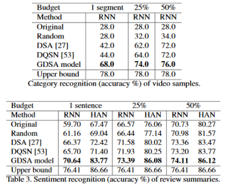

# Goal-Driven Sequential Data Abstraction

*Benchmarking machine intelligence* and *supporting summarization* applications importantly requires **automatic data abstraction**. The former deals with the apprehension of input data to produce a meaningful but more compact abstraction. Whereas, the latter exploits this capability to save space or human time by summarizing the essence of input data.

This paper deals with the study of a general re-inforcement learning based framework for learning to abstract sequential data in a goal-driven way.

## Model Features

* Goal-driven implementation of abstracting sequential data.

* Ability to define unique abstraction goals allows preservation of input data based on the purpose of abstraction.

* Elimination of the requirement of human-defined examples of ideal abstraction.

* Model processing is independent of the original order of inputs.

* *Domain Agnostic* model - Provides promising results in all domains, including sketch, video and text data.

The above model namely **GDSA**(Goal Driven Sequence Abstraction) is driven by a goal-function rather than needing expensively annotated ground-truth labels, and also uniquely allows selection of the information to be preserved rather than producing a single general-purpose summary. It provides improved performance for abstraction compared to several alternatives.

Reduced data requirements and new goal-conditional abstraction ability enables unique practical summarization applications.

Tensorflow implementation of **GDSA** for Sketch Abstraction can be found [here](https://github.com/UmarSpa/SketchAbstraction).

* [Soham Biswas](https://www.linkedin.com/in/soham-biswas-590784168/)