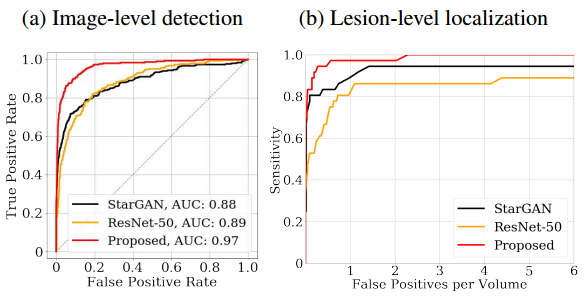

# Learning Fixed Points in Generative Adversarial Networks: From Image-to-Image Translation to Disease Detection and Localisation

[Purbayan Chowdhury](https://www.linkedin.com/in/purbayan-chowdhury-38126914a/)

The paper proposes Fixed Point GAN (fixed-point translation ability) that identifies a minimal subset of pixels for domain translation. It is trained by (1) supervising same-domain translation through a conditional identity loss, and (2) regularising cross-domain translation through revised adversarial, domain classification, and cycle consistency loss. The goal is to remove object preserving the image content and the requirements for the task are 

1. The model must handle unpaired images.
2. The model must require no source domain label when translating an image into a target domain.
3. The model must conduct an identity transformation for same-domain translation.
4. The model must perform a minimal image transformation for cross-domain translation.

## Method
The discriminator is trained to classify an image as real/fake and its associated domain.
The new training scheme offers three advantages.(1) reinforced same-domain translation, (2) regularised cross-domain translation, and (3) source-domain independent translation. 

Fixed-point GAN training scheme

**Adversarial Loss** - The generator learns the cross- and same-domain translations. The revised adversarial loss:

**Domain Classification Loss** - The domain classification loss for the generator to account for both same- and cross-domain translations, ensuring that the generated image is from the correct domain in both scenarios:

**Cycle Consistency Loss** - The modified cycle consistency loss ensures that both cross- and same-domain translations are cycle consistent.

**Conditional Identity Loss** - The generator is forced using conditional identity loss to preserve the domain identity while translating the image to the source domain and helps the generator learn a minimal transformation for translating the input image to the target domain.

**Full Objective** - Combining all losses, the final full objective function for the discriminator and generator
. The total loss, 

## Applications

### Multi-Domain Image-to-Image Translation

**Dataset** - The CelebFaces Attributes (CelebA) dataset composed of a total of 202,599 facial images of various celebrities, each with 40 different attributes is used. 5 domains (black hair, blond hair, brown hair, male, and young) is adopted for the experiments and pre-process the images by cropping the original 178×218 images into 178×178 and then re-scaling to 128×128.

**Results**

Comparison betwee StarGAN and Fixed-Point GAN for multi-domain image-to-image

| Real Image (Acc.) | Fixed-Point GAN | StarGAN |
| :---------------: | :-------------: | :-----: |
|       94.5%       |     92.31%      | 90.82%  |

Comparison between the quality of images generated by StarGAN and this method. 

| Real Image (Acc.) | Fixed-Point GAN |   StarGAN   |
| :---------------: | :-------------: | :---------: |
|    0.11 ± 0.09    |   0.36 ± 0.35   | 2.40 ± 1.24 |

### Brain Lesion Detection and Localization with Image-Level Annotation

**Dataset** - BRATS 2013 consists of synthetic and real images. The synthetic and real images is randomly splited at the patient-level into 40/10 and 24/6 for training/testing, respectively. 

**Results**

Comparing Fixed-Point GAN with StarGAN, f-AnoGAN, GAN-based brain lesion detection method

Fixed-Point GAN achieves a sensitivity of 84.5% at 1 false positive per image, outperforming StarGAN, f-AnoGAN, and Alex, et al. with the sensitivity levels of 13.6%, 34.6%, 41.3% at the same level of false positive. The ResNet-50-CAM at 32x32 resolution achieves the best sensitivity level of 60% at 0.037 false positives per image. 

### Pulmonary Embolism Detection and Localization with Image-Level Annotation

**Dataset** - Pulmonary embolism (PE) is a blood clot that travels from a lower extremity source to the lung, where it causes blockage of the pulmonary arteries. The dataset is pre-processed as suggested in [38, 31, 30], divided at the patient-level into a training set with 3,840 images, and a test set with 2,415 images.

**Results**

Comparing Fixed-Point GAN with StarGAN, f-AnoGAN, and ResNet-50 on the PE dataset.

Fixed-Point GAN achieves an AUC of 0.9668 while StarGAN and ResNet-50 achieve AUC scores of
0.8832 and 0.8879, respectively.

The code is available [here](https://github.com/jlianglab/Fixed-Point-GAN).

