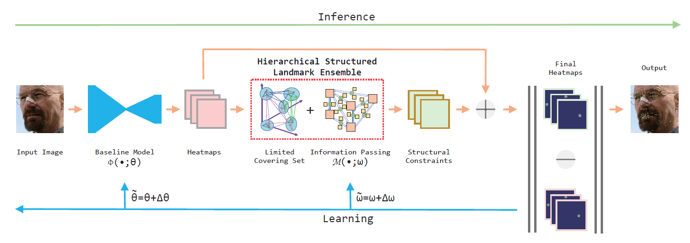
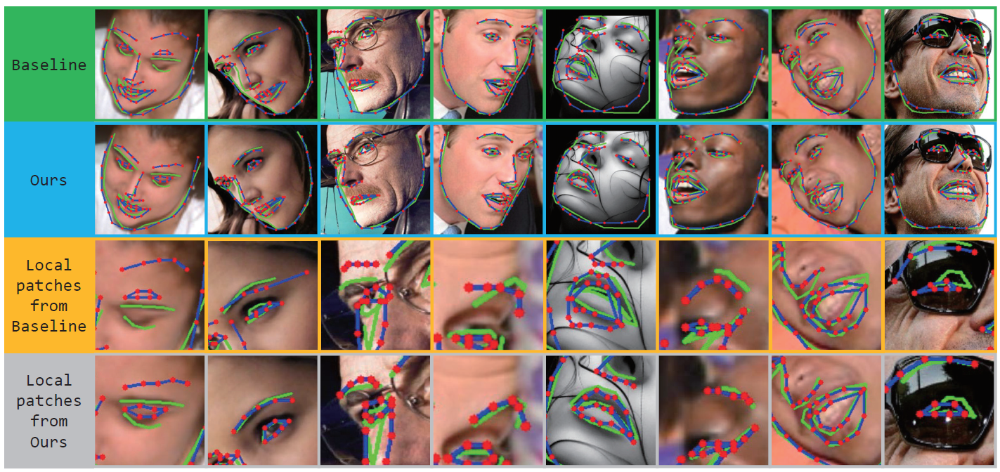

# Learning Robust Facial Landmark Detection via Hierarchical Structured Ensemble
In this paper, a novel Hierarchical Structured Landmark Ensembles (HSLE) model is proposed to hierarchically represent both holistic and local structures for facial landmarks.

by <a href="http://www.linkedin.com/in/rajatava-mukherjee-6a3784182">Rajatava Mukherjee</a>

## The Purpose of The Work:

Facial landmark detection is a very important task for face recognition face modeling. Due to the large variability of face shapes, head poses, lighting conditions, and background occlusions, facial landmark detection still remains challenging. in this work, they try to answer an important question that if it is possible to automatically construct suitable hierarchical structure for learning robust facial landmark detection.
 

## Related works:

Since 1992, A large number of impressive works for facial landmark detection have been made. Because only landmarks with sufficient discrimination(e.g. corners of the ocular, corners of the mouse, and nose tip etc.) can be reliably located, structural constraints are usually adopted by former classic artworks, including Active Shape Models, Active Appearance Models, Constrained Local Models, and Cascade Regression Models. Recently, Deep Convolutional Neural Networks (CNN) have advanced the progress of facial landmark detection. There is a hierarchical deformable part model, proposed for localizing facial landmarks, which consists of a manually designed tree of parts but would fail if the root node of the tree missed. There is also a structured feature learning framework proposed to reason the correlations among body joints in human pose estimation. Since the number of facial landmarks is much more than the number of joints used in pose estimation, passing information between so many facial landmarks cannot be solved by a manually designed tree structure which is not robust enough either.

## The work-flow: 

<ol>
<li>They propose a novel Hierarchical Structured Landmark Ensembles (HSLE) model to hierarchically depict holistic and local structures for facial landmarks. Our proposed HSLE can be readily plugged into any existing facial landmark detection baselines for further performance improvement.</li>
<li>Due to the structural constraints propagated from the HSLE, the baseline facial landmark detector becomes more robust by trained jointly with the HSLE in an end-to-end fashion.</li>
<li>Compared with the manual structure design-based methods, this automatically learned hierarchical structure is more reliable and robust to failure landmark detection, because structural constraints are automatically mined from data via discovering the most robust patterns.</li>
<li>Their approach significantly outperforms the baseline by a large margin to achieve a
state-of-the-art result. The effectiveness of their model has been verified by extensive experiments on the huge data-set.</li>
</ol>

Figure 1: The framework of the proposed approach

## The Method Followed:

Simultaneously modeling both holistic and local structures would be helpful for localizing facial landmarks more robustly. They propose a Hierarchical Structured Landmark Ensemble (HSLE) model for learning robust facial landmark detection by using it as structural constraints. The framework of the proposed approach is illustrated in Figure 1. The entire model can be jointly learned in an end-to-end fashion. The proposed HSLE model served as hierarchical structural constraints of facial landmarks. HSLE is a directed graph model. Each node in HSLE denotes a predefined landmark. Relationships  represented by information passing between connected nodes are denoted as edges in HSLE.They implement information passing as convolutional kernels. This limited Covering Set model enforces that each landmark should be included in at least one substructure. Landmarks with stable relative relations (the relationship between a pair of landmarks should be invariant to head pose or facial expression to some extent) are preferred to be clustered into the same ensemble. This is followed by Pattern Discovery for HSLE Construction and Model Training.

## About the Experiment:

To verify the effectiveness of the proposed model, They evaluate the model on two data-sets . 3148 images for training and 689 images for testing are used. The testing data-set is split into three subsets: common subset (554 images), challenge subset (135 images) and the full set (689 images). Each image is annotated with 68 landmarks.
Some qualitative results on the data-set are presented in Figure 3. Images with different color borders are results derived from one baseline and the proposed HSLE model respectively. The results from images with unconstrained situations demonstrate that the baseline facial landmark detector becomes much more robust by trained jointly with HSLE in an end-to-end fashion, due to the structural constraints propagated from the HSLE model.
In order to make a clearer study of the impact of the HSLE model on the overall performance, some further supplementary experiments are conducted on a separate data-set.

Figure 2: Qualitative results on the 300W. Images with green borders (row 1) are results derived from a baseline model directly. Images with blue borders (row 2) are results derived from our HSLE model. Images with yellow borders (row 3) and images with gray borders (row 4) are local enlarged image patches from the baseline and ours respectively. BLUE curves and RED dots are predictions. GREEN curves are ground truth.

So, In this paper, a Hierarchical Structured Landmark Ensemble (HSLE) model is resented for learning robust facial landmark detection. Due to the structural constraints propagated
from the HSLE, the baseline facial landmark detectors consistently become more robust by trained jointly with the HSLE in an end-to-end fashion. The effectiveness of this idea has been verified by extensive experiments, indicates that facial landmark detection can be more robust via learning from hierarchical structural constraints.

