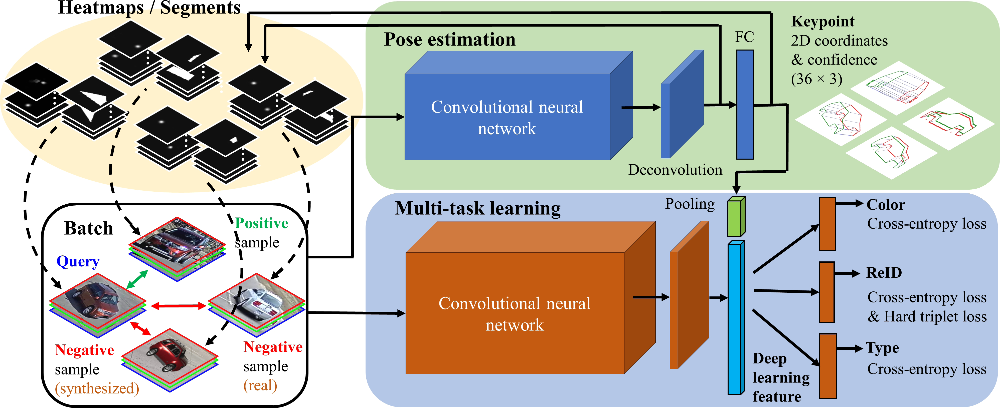
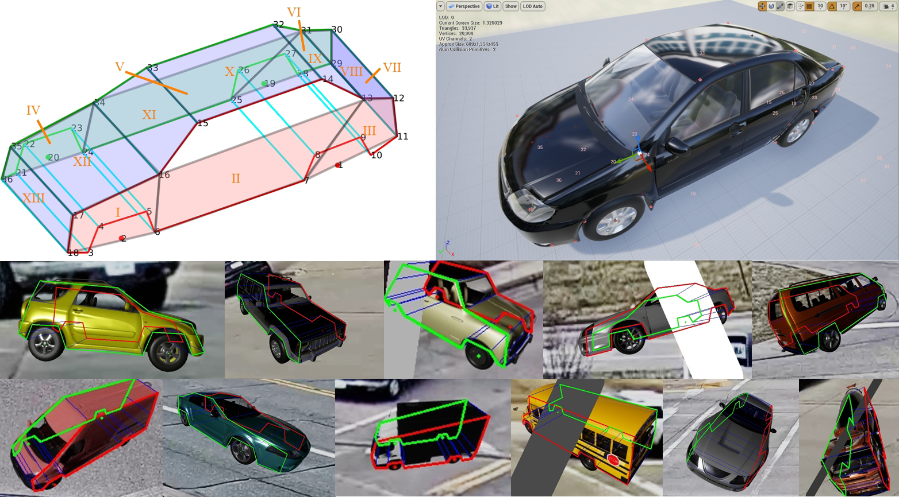
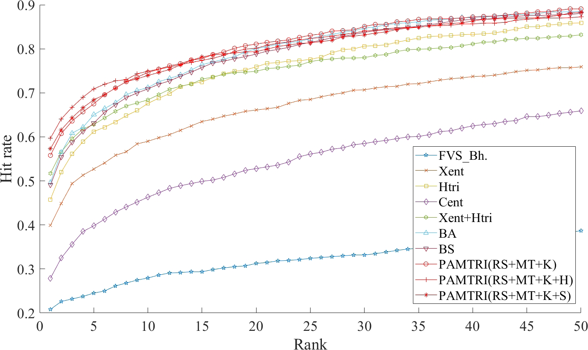

# PAMTRI: Pose-Aware Multi-Task Learning for Vehicle Re-dentification Using Highly  Randomized Synthetic Data

**Vehicle ReID** has become popular area of research in recent years due to very wide deployment of traffic cameras. The Proposed method **PAMTRI** deals with crucial problem of cross-camera Association of target like pedestrian and vehicle in Video analytics.

## Major Contribution of PAMTRI:

1. It embeds keypoints, heatmaps and segments from pose estimation into the multi-task learning pipeline for vehicle ReID, which guides the network to pay attention to viewpoint-related information.
2. PAMTRI is trained with large-scale synthetic data that include randomized vehicle models, color and orientation under different backgrounds, lighting conditions and occlusion. Annotations of vehicle identity, color,type and 2D pose are automatically generated for training.

3. It achieves significant improvement over the state-of-the-art on two mainstream benchmarks: VeRi and CityFlow-ReID.

## Existing Models VS PAMTRI

Initial works for vehicle ReID involved Siamese neural network with contrastive loss for training,then researchers made attempts using distance metric learning by extending the success of triplet embedding in person ReID to the vehicle-based task.
Some methods focus on exploiting viewpoint-invariant features while other methods involved multi-task learning to address multi-grain ranking and attribute classification simultaneously, but the search for visually similar vehicles is different from our goal of ReID.
None of the methods jointly embody pose information and multi-task learning to address vehicle ReID. 

## PAMTRI Methodology

    
    <h6>Overview of the proposed method. Each training batch includes both real and synthesized images. To embed pose information for multi-task learning, the heatmaps or segments output by a pre-trained network are stacked with the original RGB channels as input. The estimated keypoint coordinates and confidence scores are also concatenated with deep learning features for ReID and attribute (color and type) classification. The pose estimation network (top, blue) is based on HRNet], while the multi-task learning network (bottom, orange) is based on DenseNet121. Best viewed in color.</h6>

We generated a large-scale synthetic dataset by employing our deep learning dataset synthesizer (NDDS) to create a randomized environment in Unreal Engine 4 (UE4), into which 3D vehicle meshes from were imported. We added to NDDS the ability to label and export specific 3D locations, *i.e*., keypoints (denoted as *sockets* in UE4), on a CAD model. We train a robust DNN for extracting pose-related representations,to leverage viewpoint-aware information for multi-task learning. Two ways were proposed to embed the vehicle pose information. In one approach, after the final deconvolutional layer, we extract the 36 heatmaps for each of the keypoints  used to capture the vehicle shape and pose. In the other approach, the predicted keypoint coordinates from the final fully connected (FC) layer are used to segment the vehicle body.

Vehicle pose describes the 3D shape model that is invariant to the camera viewpoint, and thus the ReID sub-branch can learn to relate features from different views. Also the vehicle shape is directly connected with the car type to which the target belongs and the segments by 2D keypoints enable the colour classification sub-branch to extract the main vehicle colour while neglecting the non-painted areas such as windshields and wheels.

    
    <h6>TOP-LEFT: The 36-keypoint model  with 13 segments defined by us. TOP-RIGHT: 3D keypoints selected in UE4. BOTTOM: Example images from our randomized synthetic dataset for training, with automatically annotated poses overlaid.</h6>

In our experiments, we strictly follow the evaluation protocol proposed in Market150 measuring the mean Average Precision (mAP) and the rank-K hit rates. For mAP, we compute the mean of all queries’ average precision, *i.e.*, the area under the Precision-Recall curve. The rank-K hit rate denotes the possibility that at least one true positive is ranked within the top K positions. When all the rank- K hit rates are plotted against K, we have the Cumulative Matching Characteristic (CMC).

    
    <h6>CMC curves of state-of-the-art methods on CityFlow-ReID. Note that variants of our proposed method improve the state-of-the-art performance. Best viewed in color</h6>

## Conclusion

This proposal of PAMTRI for joint vehicle ReID and attribute classification works by focussing on both aspects, Multi-task learning as well as Vehicle Pose Estimation. Also the need of heavily annotated vehicle information on large scale datasets is being meet by generating a highly randomized synthetic dataset we also generate a highly randomized synthetic dataset, in which a large variety of viewing angles and random noise such as strong shadow, occlusion, and cropped images are simulated. PAMTRI achieves top performance in both benchmarks, VeRi as well as CityFlow-ReID. In addition to all,it also benefits the subtasks on attribute classification and vehicle pose estimation. 
                          