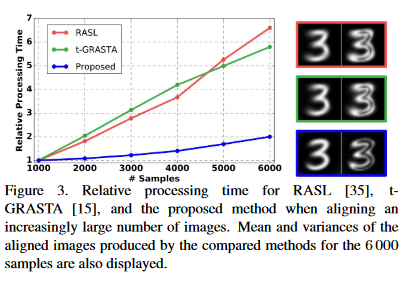

# Jointly Aligning Millions of Images With Deep Penalised Reconstruction Congealing

Several Computer Vision and graphics problems such as *co-segmentation*, *super-resolution*, etc. can be solved by *extrapolation* of fine-grained pixel-level correspondences in an unsupervised manner, from a large set of mis-aligned images. Several such joint image alignment and congealing techniques have been proposed to takle the problem, but they have **poor scalability** and alignment accuracy **hampers** their wide applicability.

To overcome this limitation, a new *unsupervised joint alignment* method was proposed in this paper.

## Proposed Method Features

* Congealing (joint image alignment) method capable of handling large-scale joint alignment problems, simultaneously.

* Leverages a densely fused spatial transformer network to estimate the wraping parameters for each Image.

* Utilizes a low-capacity auto-encoder whose reconstruction error is used as an auxiliary measure of joint alignment.

* A novel *differentiable* formulation of the congealing problem, which combines the advantages of previously proposed similarity and rank-based approaches and that can be optimised with Stochastic Gradient Descent.

* An extensive experimental evaluation of the proposed method and state-of-the-art approaches on several benchmarking datasets, such as MNIST, LFW etc.

Experimental results on digits from multiple versions of MNIST(i.e original, perbuted, *affNIST* and *infiNIST*) and faces from LFW, show that the proposed method is capable of aligning millions of images with high accuracy and robustness to different levels and types of perturbation.

## Proposed Method v/s other Methods

* Proposed Method is more scalabe compared to other methods.

* Unsupervised joint alignment in the proposed method has less computational complexity compared to other methods, such as SIFT, HOG etc.

* Other state-of-the-art methods are unable to simultaneously handle variability in terms of illumination, gross pixel corruptions and/or partial occlusions, whereas with the help of an aligner and low-capacity auto-encoder, the proposed method is able to tackle this issue.

*Qualitative* and *Quantative* results suggest that the proposed method outperforms state-of-the-art approaches both in terms of alignment quality and robustness to initialisation.

* [Soham Biswas](https://www.linkedin.com/in/soham-biswas-590784168/)
