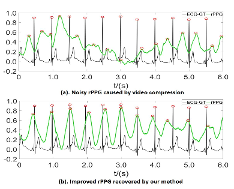
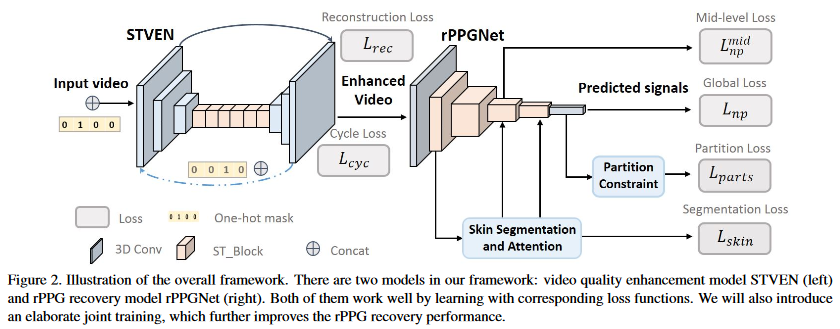
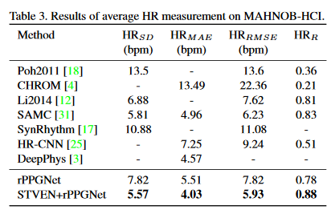

# Remote Heart Rate Measurement from Highly Compressed Facial Videos

The measurement of *heart* activity without any physical contact, namely **Remote Photoplethysmography(rPPG)**, has great potential in many applications such as remote healthcare etc.

Existing *rPPG* approaches rely on analysing very fine details of facial videos, which are prone to be affected by *video compression*. Hence, a two-stage, end-to-end method has been proposed in this paper to *counter* video compression loss and *recover* rPPG signals from highly compressed videos.

## Model Features

* Two-staged, end-to-end method using hidden rPPG information enhancement and attention networks.

* First ever method to counter video compression loss and recover rPPG signals from highly compressed videos.

* Model consists of two parts:
  * Spatio-Temporal Video Enhancement Network(STVEN) for video Enhancement.
  * rPPG network(rPPGNet) for rPPG signal recovery.

* rPPGNet is *robust* enough to work on its own for rPPG measurement, but STVEN network can be added and jointly trained to further boost the performance especially on highly *compressed* videos.

**Related Work:** Remote Photoplethysmography Measurement, Video Compression and its impact for rPPG, Quality Enhancement for Compressed Video.

## Proposed Method v/s other Methods

* First ever solution for robust rPPG measurement directly from compressed videos.

* rPPGNet is featured with a skin-based attention module and partition constraints. It can measure both *HR* and *HRV* levels accurately. Compared to previous methods which can only output simple HR numbers, the proposed rPPGNet produces much richer rPPG signals with curve shapes and peak locations.

* Outperforms state-of-art methods on various video formats of a benchmark dataset even without using the STVEN module.

* The STVEN module is the first video compression enhancement network to boost rPPG measurement on highly compressed videos.

## Conclusion

* Achieves superior performance on compressed videos with high-quality videos pair.

* Generalises well on novel data with only compressed videos available, which implies the promising potential for real-world applications.

In most cases *rPPGNet* can outperform other methods, especially at very low bitrate of 250Kb/s. This demonstrates the robustness of the model.

* [Soham Biswas](https://www.linkedin.com/in/soham-biswas-590784168/)