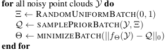
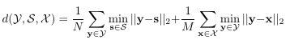
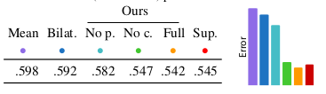

# Total Denoising: Unsupervised Learning of 3D Point Cloud Cleaning

[Purbayan Chowdhury](https://www.linkedin.com/in/purbayan-chowdhury-38126914a/)

The paper states the unsupervised method of denoising of 3D [point cloud](https://en.wikipedia.org/wiki/Point_cloud), it overcomes the limitation of 'total' (requirement of a pair of two noisy scans of same object and theoretical difficulty of that noise in 3D point cloud). It focusses on deriving formalism unstructured domain using the three methods used in regular domain namely,

1. Supervised (mapping with a clean and a noisy pixel),
2. Unsupervised, paired (mapping a noisy image with another noisy one) and,
3. Unsupervised, unpaired (mapping all noisy observation in one image).

For unstructured domain, supervised method minimises the sum of losses between the estimated function and the surface of 3D object. It is evident paired unsupervised is not possible as neither obtaining two realizations of same point cloud corrupted by two different noise nor having a network architecture that explicitly encodes regular structure of an image in each pixel. So, unpaired unsupervised solves the issue where only an incompleteness function is to defined for learning neighbour from a point.

They regularize the problem by imposing the prior q(z&#124;y) that captures the probability that a given observation y is a realization of the clean point z and uses a combination of spatial and appearance proximity that results in convergence to the nearest (in space and appearance) mode when optimizing.

## Implementation

- **Prior** - The samples are drawn according to the prior q done by rejection sampling: pick a random point from input and train on it if its spatial estimator is satisfied.

- **Architecture** - An unstructured encoder-decoder based on Monte Carlo architecture where encoder transforms points into latent codes defined on a coarser point set and decoder upsamples these to original resolution. There are two levels of encoding - one with 5% and other with 10% receptive field.

- **Training** - An ADAM optimizer with initial learning rate of 0.005 is used on a set of prior samples q for all points in cloud.

- **Iteration** - For better results, the previous output is fed as input for next iteration and to avoid clustering, regularization is applied to enforce equidistant samples.

<b>Algorithm</b>

A 15 different classes with 7 different polygonal models each is used as dataset. In simple noise model, each mesh uses Poisson Disk sampling to obtain clean point clouds. The advanced model enables true sensor noise using Blendsor. The metric for measurement is minimizing Chamfer distance

Along with the unsupervised classic variants MEAN, BILATERAL and supervised approach, they made three other approaches namely, one with NO PRIOR, second with NO COLOR, and third FULL with all contributions. Only last one use XYZRGB point clouds and other two use XYZ point clouds.

The full method outperforms all of other five variants. From the experiments, the effect of no prior, no colour and no appearance is evident.
